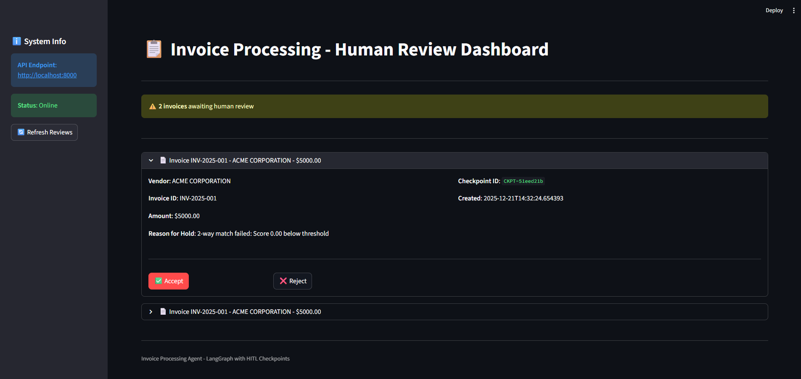
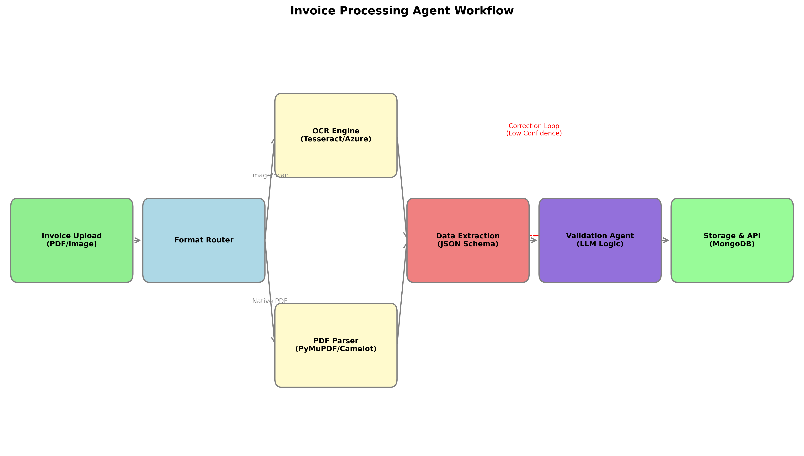

# 📋 **LangGraph Invoice Processing Agent with HITL**

An intelligent invoice processing system built with **LangGraph**, featuring **Human-in-the-Loop (HITL)** checkpoints, **dynamic tool selection** (Bigtool), and **MCP client orchestration**.

---

## 🎯 **Features**

- ✅ **12-Stage Workflow**: Complete invoice processing from intake to completion
- 🤝 **HITL Checkpoints**: Pause workflow for human review when 2-way matching fails
- 🔄 **Resume Capability**: Seamlessly resume workflows after human decisions
- 🛠️ **Bigtool System**: Dynamic tool selection from capability-based pools
- 🔌 **MCP Integration**: Mock COMMON & ATLAS clients for deterministic and external operations
- 💾 **Checkpoint Persistence**: SQLite-based state storage with full audit logging
- 🌐 **FastAPI Backend**: Async REST API for workflow management
- 📊 **Streamlit Dashboard**: Interactive UI for human review
- 🐳 **Docker Ready**: Containerized deployment with docker-compose
- 🧪 **Comprehensive Testing**: Automated test suites for Docker containers

---

## 🏗️ **Architecture Overview**

### **Workflow Stages**

```
┌─────────────┐
│   INTAKE    │  ① Validate & persist invoice
└──────┬──────┘
       │
┌──────▼──────┐
│ UNDERSTAND  │  ② OCR extraction & parsing
└──────┬──────┘
       │
┌──────▼──────┐
│   PREPARE   │  ③ Normalize vendor & enrich data
└──────┬──────┘
       │
┌──────▼──────┐
│  RETRIEVE   │  ④ Fetch POs, GRNs, history
└──────┬──────┘
       │
┌──────▼──────┐
│MATCH_TWO_WAY│  ⑤ Compute 2-way match score
└──────┬──────┘
       │
       ├─ Match Failed ─┐
       │                 │
       │          ┌──────▼────────┐
       │          │CHECKPOINT_HITL│  ⑥ Create checkpoint & pause
       │          └──────┬────────┘
       │                 │
       │          ┌──────▼─────────┐
       │          │ HITL_DECISION  │  ⑦ Wait for human decision
       │          └──────┬─────────┘
       │                 │
       └─ Match OK ──────┘
                  │
           ┌──────▼──────┐
           │  RECONCILE  │  ⑧ Build accounting entries
           └──────┬──────┘
                  │
           ┌──────▼──────┐
           │   APPROVE   │  ⑨ Apply approval policy
           └──────┬──────┘
                  │
           ┌──────▼──────┐
           │   POSTING   │  ⑩ Post to ERP
           └──────┬──────┘
                  │
           ┌──────▼──────┐
           │    NOTIFY   │  ⑪ Send notifications
           └──────┬──────┘
                  │
           ┌──────▼──────┐
           │   COMPLETE  │  ⑫ Finalize workflow
           └─────────────┘
```
---

## Here’s a preview of the Human Review Dashboard:


---

## 🎥 **Demo Video**

Watch the complete workflow in action:

[▶️ Watch Demo Video](https://drive.google.com/file/d/1HAgOFNxMiT2HiBEC1MHsYKqAvEs1x3vM/view)

---
### **Technology Stack**

- **Orchestration**: LangGraph
- **Backend**: FastAPI + Uvicorn
- **Frontend**: Streamlit
- **Database**: SQLite (SQLAlchemy ORM)
- **Checkpointing**: LangGraph SqliteSaver
- **LLMs**: Google Gemini + Groq (fallback)
- **OCR**: Tesseract

---

## 📊 Project Workflow



*Complete end-to-end pipeline from data ingestion to deployment*

---

## 📁 **Repository Structure**

```
Invoice-Processing-Agent/
├── src/invoice_agent/
│   ├── agent/
│   │   ├── langgraph_workflow.py    # LangGraph workflow definition
│   │   └── workflow_executor.py     # Start/resume helpers
│   ├── nodes/
│   │   ├── workflow_nodes_1.py      # Stages 1-5
│   │   └── workflow_nodes_2.py      # Stages 6-12
│   ├── mcp/
│   │   ├── common_client.py         # COMMON server mock
│   │   └── atlas_client.py          # ATLAS server mock
│   ├── bigtool/
│   │   ├── bigtool_picker.py        # Tool selection engine
│   │   └── tools/                   # OCR, ERP, email, enrichment tools
│   ├── database/
│   │   ├── models.py                # SQLAlchemy models
│   │   └── checkpoint_store.py      # Checkpoint persistence
│   ├── models/
│   │   ├── invoice_models.py        # Pydantic models
│   │   ├── state_models.py          # WorkflowState TypedDict
│   │   └── api_models.py            # API request/response
│   ├── api/
│   │   ├── main.py                  # FastAPI app
│   │   └── routes/                  # Workflow & review endpoints
│   ├── frontend/
│   │   └── app.py                   # Streamlit dashboard
│   └── utils/
│       ├── logger.py                # Logging setup
│       └── exceptions.py            # Custom exceptions
├── config/
│   └── workflow.json                 # Workflow configuration
├── data/sample_invoices/             # Sample test data
├── scripts/
│   ├── setup_db.py                   # Database initialization
│   └── run_demo.py                   # Demo script
├── pyproject.toml                    # Dependencies (uv)
└── README.md                         # This file
```

---

## 🚀 **Getting Started**

### **Prerequisites**

- Python 3.11+
- `uv` package manager ([astral.sh/uv](https://astral.sh/uv))

### **Installation**

1. **Clone the repository**:
   ```bash
   git clone <your-repo-url>
   cd Invoice-Processing-Agent
   ```

2. **Create virtual environment**:
   ```bash
   uv venv
   source .venv/bin/activate  # On Windows: .venv\Scripts\activate
   ```

3. **Install dependencies**:
   ```bash
   uv sync
   ```

4. **Setup environment variables**:
   ```bash
   cp .env.example .env
   ```
   
   Update `.env` with your API keys:
   ```
   GOOGLE_API_KEY=your_google_api_key
   GROQ_API_KEY=your_groq_api_key
   ```

5. **Initialize database**:
   ```bash
   python scripts/setup_db.py
   ```

6. **If want to use OCR(tesseract), install it first**:
   - Official Installation Documentation Page for all supported platforms: https://tesseract-ocr.github.io/tessdoc/Installation.html
   - For Windows(from Official Installation Documentation Page itself): https://github.com/UB-Mannheim/tesseract/wiki
---
## 💻 **Usage**

### **Option 1: Run with Docker (Recommended)**

```bash
docker-compose up --build
```

- **API**: http://localhost:8000
- **Dashboard**: http://localhost:8501
- **API Docs**: http://localhost:8000/docs

### **Option 2: Run Locally**

**Terminal 1 - API Server**:
```bash
uvicorn invoice_agent.api.main:app --reload
```

**Terminal 2 - Streamlit Dashboard**:
```bash
streamlit run src/invoice_agent/frontend/app.py
```

---

## 🧪 **Testing in Docker Containers**

### **Quick Test - Verify Everything Works**

```bash
# Ensure containers are running
docker ps
```

### **Available Test Scripts**

#### **1. Comprehensive Python Tests** (`scripts/docker_test.py`)

Tests all aspects of the containerized application:
- ✅ Database initialization and operations
- ✅ Checkpoint store functionality
- ✅ Workflow execution (perfect match & HITL)
- ✅ Bigtool dynamic selection
- ✅ MCP client operations

**Usage:**
```bash
# Copy script to container (first time only)
docker exec invoice_agent_api mkdir -p /app/scripts
docker cp scripts/ invoice_agent_api:/app/

# Run demo test
docker exec invoice_agent_api python /app/scripts/run_demo.py

# Run comprehensive test suite
docker exec invoice_agent_api python /app/scripts/docker_test.py
```

#### **2. Individual Component Tests**

**Test API Health:**
```bash
docker exec invoice_agent_api curl http://localhost:8000/health
```

**Test Workflow Execution:**
```bash
docker exec invoice_agent_api python -c "import asyncio, json; from invoice_agent.agent.workflow_executor import start_workflow; import sys; f = open('/app/data/sample_invoices/invoice_001_perfect_match.json'); invoice = json.load(f); f.close(); result = asyncio.run(start_workflow(invoice)); print('Status:', result['status']); print('Workflow ID:', result['workflow_id'])"
```

**Test Database:**
```bash
docker exec invoice_agent_api python -c "from invoice_agent.database.models import init_db; init_db(); print('Database initialized successfully!')"
```

**Test Module Imports:**
```bash
docker exec invoice_agent_api python -c "from invoice_agent.api import main; from invoice_agent.agent import workflow_executor; from invoice_agent.database import models; from invoice_agent.bigtool import bigtool_picker; print('All modules imported successfully!')"
```

### **Test All Sample Invoices**

```bash
# Test from host machine
curl -X POST http://localhost:8000/workflow/start \
  -H "Content-Type: application/json" \
  -d @data/sample_invoices/invoice_001_perfect_match.json

curl -X POST http://localhost:8000/workflow/start \
  -H "Content-Type: application/json" \
  -d @data/sample_invoices/invoice_002_amount_mismatch.json
```

### **View Container Logs During Testing**

```bash
# Watch API logs
docker logs -f invoice_agent_api

# Watch UI logs
docker logs -f invoice_agent_ui

# View last 100 lines
docker logs --tail=100 invoice_agent_api
```

### **Interactive Container Testing**

```bash
# Access container shell
docker exec -it invoice_agent_api bash

# Inside container, run any Python code or tests
python /app/scripts/docker_test.py
curl http://localhost:8000/health
ls -la /app/data/

# Exit
exit
```

### **Expected Test Results**

✅ **6+ tests should pass**, including:
- Database initialization
- Checkpoint operations
- HITL checkpoint creation
- Bigtool selection
- MCP clients (COMMON & ATLAS)

📝 **Test output provides detailed logs** for debugging if any test fails.

---

## 🧪 **Running the Demo**

```bash
python scripts/run_demo.py
```

This will process 3 sample invoices:
1. **Perfect Match** → Auto-completes
2. **Match Failure** → Creates HITL checkpoint
3. **New Vendor** → Enrichment + completion

---

## 🔌 **API Endpoints**

### **Workflow Management**

**Start Workflow**:
```bash
POST /workflow/start
Content-Type: application/json

{
  "invoice_payload": {
    "invoice_id": "INV-001",
    "vendor_name": "ACME Corp",
    "amount": 2000.00,
    ...
  }
}
```

**Response**:
```json
{
  "workflow_id": "uuid",
  "status": "RUNNING",
  "current_stage": "MATCH_TWO_WAY",
  "checkpoint_id": "CKPT-xxxx",
  "review_url": "http://localhost:8501/review/CKPT-xxxx"
}
```

### **Human Review**

**List Pending Reviews**:
```bash
GET /human-review/pending
```

**Submit Decision**:
```bash
POST /human-review/decision
Content-Type: application/json

{
  "checkpoint_id": "CKPT-xxxx",
  "decision": "ACCEPT",
  "reviewer_id": "reviewer_001",
  "notes": "Approved after verification"
}
```

---

## 📊 **Bigtool Capabilities**

The Bigtool system dynamically selects tools from pools:

- **OCR**: Tesseract (mock Google Vision, AWS Textract available)
- **Enrichment**: Vendor DB (mock Clearbit, PDL available)
- **ERP Connector**: Mock ERP (SAP, NetSuite stubs available)
- **Email**: Mock Email (SendGrid, SES stubs available)
- **Storage**: Local filesystem (S3, GCS stubs available)

---

## 🗄️ **Database Schema**

**Tables**:
- `checkpoints`: Workflow state snapshots
- `human_review_queue`: Pending HITL items
- `audit_logs`: Complete workflow audit trail

## 🙏 **Acknowledgments**

Built for Analytos.ai coding task using:
- LangGraph by Langchain
- FastAPI
- Streamlit
- SQLAlchemy
- Google Gemini & Groq

---

**🔥 Ready to process invoices intelligently with human oversight!**